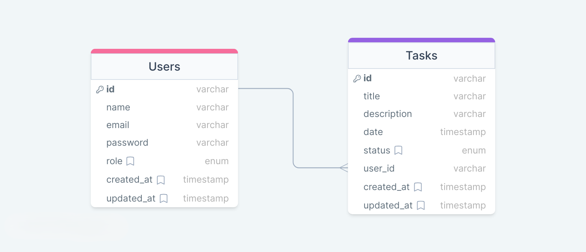

# Task Manager - RESTfull API

## Entity Relationship Diagram



## Technologies

- `Node.js`
- `Typescript`
- `Express`
- `JSON Web Token (JWT)`
- `Bcrypt`
- `Sqlite`
- `Zod`

## Installation

```bash
# clone project
$ git clone https://github.com/EmanuelQuintino/Task-Manager-API.git

# install dependencies
$ npm install

# run api
$ npm run dev
```

## Environment Variables

```ini
PORT=""
SECRET_TOKEN=""
EXPIRESIN_TOKEN=""
KEY_TOKEN=""
```

## Routes

| Functionality | Method   | Endpoint  | Description                   |
| ------------- | -------- | --------- | ----------------------------- |
| Auth          | `POST`   | /login    | Start the user session        |
|               | `POST`   | /logout   | Close the user session        |
| User          | `GET`    | /user     | Return user informations      |
|               | `POST`   | /user     | Create a new user             |
| Tasks         | `POST`   | /task     | Add a new task                |
|               | `GET`    | /tasks    | Return **\*pagination** tasks |
|               | `PUT`    | /task/:id | Update an existing task       |
|               | `DELETE` | /task/:id | Remove an existing task       |

**\*Pagination parameters**

- `limit:` Number of items per page.
- `offset:` Offset index.
- `filter:` Filter options `"all"`, `"completed"`, `"pending"`, `"late"`.
- Query example: `"/tasks?limit=10&offset=0&filter=all"`.

## Links

- [Deploy](https://task-manager-seven-indol.vercel.app/)
- [Front Repository](https://github.com/EmanuelQuintino/Task-Manager)